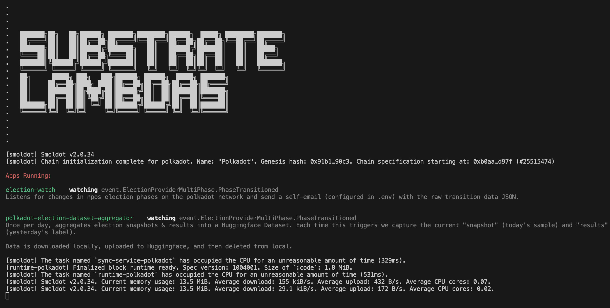

Doing ***\<thing\>*** when ***\<trigger\>*** occurs is quite useful. Listening for ***\<trigger\>*** is *computationally inexpensive* but requires **something to always be on**. Doing ***\<thing\>*** may be *computationally expensive* but only requires **on-demand availability**.

> *Everyone & their mother* should have something between a raspberry-pi and a router plugged into their wall at home (i.e. a light-weight device that is always on, connected to the internet, & privately accessible). Hardware-wise, think of something like an Amazon Alexa. I feel like this product should be pretty feasible.
>
>My hope is this may enable seemingly complex background dapps to exist in a self-hosted manner
> - DCA'ing on AssetHub 
> - Pay for & launch external GPU-server workloads
> - Some chain-reaction of events triggering other events
> - Extensive & highly customizable notification services
>
>which require no signing, since actions taken on your behalf are being run from your local, trusted machine. Many pseudo-backends can be built into this at-home lambda layer, and front ends can tweak settings with secure direct connection.

### Repository Goals

**(1)** Provide developers with a platform to rapidly develop & easily deploy *lambda* style applications which follow a standardized design pattern & set of tools. One important tool will be the ability to launch remote workers across various cloud providers.

**(2)** Provide users with platform to easily plug-n-play various *"apps"* or *"plugins"* built by developers

**(3)** Be as lightweight as possible

**(4)** Be as readable as possible for a layperson (specifically *app* code, but also *core* code where possible). *Code is truth— no process is trustless unless you personally can read the code.*

# Setup
run locally with `npx tsx src/index.ts`

### **fly.io**
```
brew install flyctl
```

<br>

This will prompt you to login and requires you to connect your credit card. _I think_ that I've set up the settings s.t. you won't be charged anything.

```bash
# launch
fly apps create substrate-lambdas
fly deploy
fly scale count 1 -y # scale downn to single node

# shut down
fly apps destroy substrate-lambdas -y
```

<br><br>

# Apps
Applications are expected to be defined in `src/apps/<app-name>/index.ts` with the following four variables defined:

```ts
import { dot } from "@polkadot-api/descriptors";
import { Context, Payload } from "@lambdas/app-support";

export const watching = "event.Something.ImWatching";
export const description = "Description of how this app works & what it does";

export function trigger(
    content: Payload<typeof watching>,
    context: Context<typeof dot>
): boolean {
    // do some filtering . . .
}

export function lambda(
    content: Payload<typeof watching>,
    context: Context<typeof dot>
) {
    // perform some work . . .
}
```

## Hardware Campaign
...

<br><br><br>


###### ***built on [papi](https://papi.how/)***