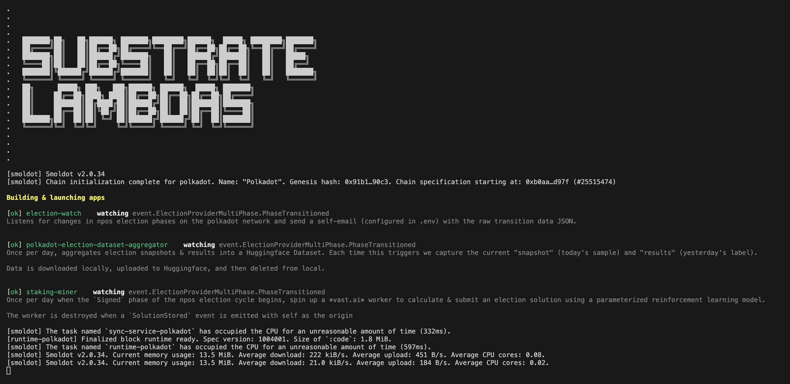

Doing ***\<thing\>*** when ***\<trigger\>*** occurs is quite useful. Listening for ***\<trigger\>*** is *computationally inexpensive* but requires **something to always be on**. Doing ***\<thing\>*** may be *computationally expensive* but only requires **on-demand availability**.

#### *Substrate Lambdas aims to provide a* **self hosted FaaS** *(function-as-a-service) platform.*

### Repository Goals

**(1)** Provide developers with a platform to rapidly develop & easily deploy *lambda* style applications which follow a standardized design pattern & set of tools. One important tool will be the ability to launch remote workers across various cloud providers.

**(2)** Provide users with platform to easily plug-n-play various *"apps"* or *"plugins"* built by developers

**(3)** Be as lightweight as possible

**(4)** Be as readable as possible for a layperson (specifically *app* code, but also *core* code where possible). *Code is truth— no process is trustless unless you personally can read the code.*

# Features
### Syntactic Sugar
Substrate Lambdas leveragees Typescript's rich type system to build an elegant app development experience resting on top of ***[papi](https://papi.how/)***. When designing the interface, our goal is to allow app developers to easily specify their applications intentions with:
1. **minimal required** prior knowledge of irrelevant blockchain concepts
2. **minimal required** code for an app's specification *(without introducing rigidity or obfuscating what's going on under-the-hood)*

```ts
import { App, Observables } from "@lambdas/app-support";

const description = `
Description of how this app works & what it does
`;

export default App(description, {
    watching: Observables.SomeChainId.event.SomePalletId.SomeEvent,
    trigger: (payload, context) => {
        // do some filtering . . .
    },
    lambda: (payload, context) => {
        // do something upon triggering . . .
    },
}, { /** More routes across many chains . . . */ });
```
`Observables` is a powerful entry point which stitches together [`TypedAPI`](https://papi.how/typed#typedapi)'s across all chains with [available descriptors](https://papi.how/codegen), with additional features. It
- acts as a point of *discovery* for what is available across the polkadot ecosystem.
- captures real-valued meta data about an application (such as *chain dependencies* of this application)
- seemlessly makes relevant type information available to developers
- **[todo!]** allows specifying *Blanket* routes on events, which observe many events at once. For example, we may specify `Observables.Polkadot.event.Balances`to watch all events within Polkadot's *Balances* pallet, or `Observables.Polkadot.event` to watch all Polkadot events, with a single route.

You can refer to the list of supported [known chains](https://github.com/polkadot-api/polkadot-api/tree/main/packages/known-chains).

### Workers
A core feature of Substrate Lambdas is the ability for apps to launch remote jobs in response to on-chain events. We provide a simple unified interface for app developers to launch jobs across a variety of cloud providers & server types.

| Platform                                  | Type      | Provider     | Payment Method |Development Status|
|-|-|-|-|-|
| [Vast.ai](https://vast.ai/)               | GPU       | Open marketplace |Credit Card ☹️ |⚠️ Experimental
| [OctaSpace](https://octa.space/)          | GPU       | Open marketplace |Ethereum 🤠 *(Maybe native Polkadot ecosystem support in future? 🥰)* | 🔄 To-do
| [Libcloud](https://libcloud.apache.org/)  | CPU/GPU   | Supports [more than 50](https://libcloud.readthedocs.io/en/stable/supported_providers.html) mainstream cloud providers |Credit Card ☹️ | 🔄 To-do
| *Self | CPU/GPU       | Self-hosted |**--** |🔄 To-do

### App Registry
Substrate Lambdas will provide an app registry for developers to publish their apps to. The first iteration of the registry will simply be a [HuggingFace](https://huggingface.co/) repository with a folder for each app. Developers will upload their apps using the `dothome` CLI. This will allow developers to easily publish/modify their own applications while restricting access to modify unpermissioned sections of the repository hosting the registry.

Why HuggingFace? Well— it's git configured for handling big data... and gives you *A LOT* of free storage 🤫. Great for dumping artifacts.

### CLI: `dothome`
###### *Note: this command table is in the "idea simmering" stage. Largely just an aggregation of living notes that will converge to a more sensible/stable idea in the coming months*

| Command       | Sub-command   | Input         | Description       |
|---------------|---------------|---------------|-------------------|
| **`app`**     | `list`        |               | List all apps     |
|               | `status`      | \<app-name>   | Show app status   |
| **`logs`**    |               | \<app-name>   | View logs         |
| **`worker`**  | `list`        |               | List workers      |
|               | `connect`     |               | Connect to worker |
|               | `kill`        |               | Terminate worker  |
| **`overview`**| `apps`        |               | Overview of apps  |
| **`system`**  | `account`     |               | System apps info  |
|               | `users`       |               | System apps info  |
|               | `health`      |               | System apps info  |

# Quick Start
All apps in `src/apps` will be run. Any apps that you would like to disable, rename the folder with a prefix of `_`. If you would like to run a custom app, create a new app folder & follow the specification defined in the [Apps](#apps) section.

Depending on the applications running you will have to define a `.env` file in the root directory. 
```bash
# election-watch
EMAIL=<your-gmail>
PASSWORD=<your-gmail-appkey>

# polkadot-election-dataset-aggregator
HF_TOKEN=<your-huggingface-token>
REPO_NAME=<your-huggingface-repo>
```

### Local
###### *Prerequisites: [Node.js](https://nodejs.org/en/download/) & [Python](https://www.python.org/)*

Just run `setup.sh` and then `npm start`.

### Fly.io
We include a `Dockerfile` & `fly.toml` for easy deployment to [fly.io](https://fly.io/). First install the CLI tool:
```
brew install flyctl
```

The first time you run this, you will be prompted to login and connect your credit card. _I think_ that I've set up the settings s.t. you won't be charged anything.

```bash
# launch
fly apps create substrate-lambdas
fly deploy
fly scale count 1 -y # scale downn to single node

# shut down
fly apps destroy substrate-lambdas -y
```

## Create an app
Applications are expected to be defined in `src/apps/<app-name>/index.ts` with the default export defined with a `description` & any number of `routes`, using the given `App` builder. ([**Example**](src/apps/polkadot-election-dataset-aggregator/index.ts))

*In future iterations, the core of Substrate Lambdas will be available as a package & apps will be defined in their own independent projects— decoupled from the core code.*

## Hardware Campaign & Long-Term Vision
> *Everyone & their mother* should have something between a raspberry-pi and a router plugged into their wall at home (i.e. a light-weight device that is always on, connected to the internet, & privately accessible). Hardware-wise, think of something like an Amazon Alexa. I feel like this product should be pretty feasible.
>
>My hope is this may enable seemingly complex background dapps to exist in a self-hosted manner
> - DCA'ing on AssetHub 
> - Pay for & launch external GPU-server workloads
> - Some chain-reaction of events triggering other events
> - Extensive & highly customizable notification services
> - tax data aggregator
> - Fully self-hosted messaging (chain is only used for authenticity. Messages are just transient event emissions & no on-chain storage is required.)
>
>which require no signing, since actions taken on your behalf are being run from your local, trusted machine. Many pseudo-backends can be built into this at-home lambda layer, and front ends can tweak settings with secure direct connection.
...

You can get a rough idea of a longer term roadmap over on the [project board](https://github.com/users/charlesHetterich/projects/1).

<br><br><br>


###### ***built on [papi](https://papi.how/)***