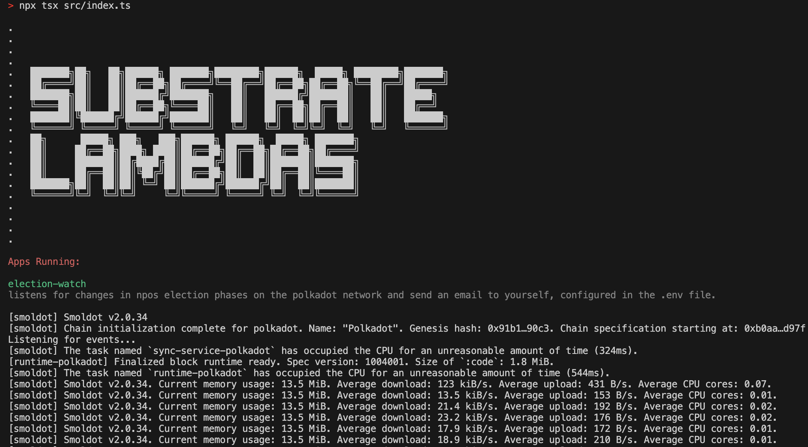

Super light weight app to run as a free fly.io session that watches for phase changes in polkadot election cycles.

Currently this simply sends an email. In the future I would like this to trigger a slightly larger process to download the election snapshot and add it to a huggingface dataset. For right now, I am the slightly larger process (aka manual style).

**Later** this will also spin up & shut down a server to calculate & submit solutions.

_An interesting slightly more ambitious idea in the future could be to to use this concept to build a general 'lambda' type SaaS that triggers lambda functions on any polkadot event_

# Setup
run locally with `npx tsx src/index.ts`

### **fly.io**
```
brew install flyctl
```

<br>

This will prompt you to login and requires you to connect your credit card. _I think_ that I've set up the settings s.t. you won't be charged anything.

```bash
# launch
fly apps create election-watch
fly deploy

# shut down
fly apps destroy election-watch
```

<br><br>

# Apps
### *Election Watch*
Super light weight app to run as a free fly.io session that watches for phase changes in polkadot election cycles.

Currently this simply sends an email. In the future I would like this to trigger a slightly larger process to download the election snapshot and add it to a huggingface dataset. For right now, I am the slightly larger process (aka manual style).